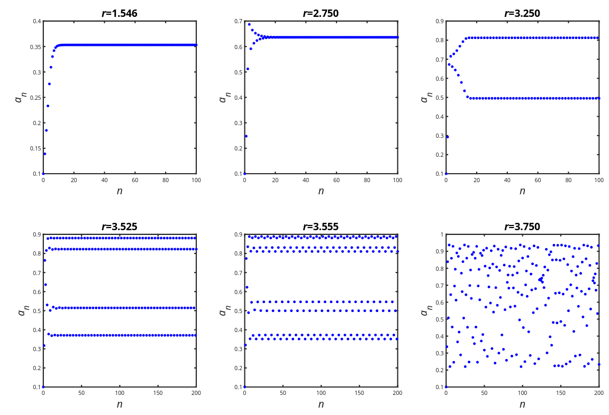

Discrete Time Systems
---

### Clarify the question, setup problem in math terms

1. Identify parameters, variables, constants
2. Identify units of measurement
3. Identify simplifying, approximations, assumptions
4. Identify the mathematical objective

### Select the modelling strategy & solution procedure

1. Optimization: single or multi-variable, constrained/unconstrained
2. Stochastic system, probabilistic calculus, random variables

### Formulate the model in standard mathematical form

1. Simplify if needed
2. Check dimensions of equations are sensible

### Solve the mathematical problem

1. Algebraic, numerical solutions
2. Stability analysis (are results stable against small disturbances)
3. Sensitivity analysis (how do results vary with parameters)

### Example

* $A_0$: initial loan amount
* $r$: annual interest rate (monthly is r/12)
* $n^*$: term of loan in months
* $R$: fixed monthly repayment to repay laon at time $n^*$

### Solution

1. Seek a solution to the homogeneous part, with trial solution $A_n=C\lambda^n$
   * $A_{n+1}=(1+\large\frac{r}{12}$)$A_n$
2. And a particular solution to, with $A_n=A^*$
   * $A_{n+1}=(1+\large\frac{r}{12}$$)A_n-R$
3. Then the general solution will be the combination
   * $A_n=C(1+\large\frac{r}{12}$$)^n+\large\frac{12R}{r}$

## Solutions to difference equations

The solution to the homogeneous DE  $a_{n+1}=ra_n \quad$ is $\quad a_k=r^ka_0, \quad r \ne 0$

### Long term behaviour

> $r=0$: all values (except maybe $a_0$) are zero
> $r=1$: $a_{n+1}=a_n$, all points are equilibrium values
> $r<0$: sequence oscillates between positive and negative values
> $|r|>1$: sequence grows boundlessly in magnitude
> $|r|<1$ sequence approaches zero as $n \rightarrow \infty$

### Dynamical systems

> Solution: $a_{n+1}=ra_n+b, \quad r \ne 1 \quad$ is $\quad a_k=r^kc+\Large\frac{b}{1-r}$
>
> Equilibrium value: $a_{n+1}=ra_n+b, \quad r \ne 1 \quad$ is $\quad a = \Large\frac{b}{1-r}$
> > $r=1$ and $b=0$: all $a_n$ are equilibrium values
> > $r=1$ and $b\ne0$: no equilibrium value exists

### Long term behaviour

> $a_{n+1}=ra_n+b, \quad b\ne 0$
> > $|r|<1$: equilibrium value is stable
> > $|r|>1$: equilibrium value is unstable
> > $r=1$: no equilibrium values

## Non-linear systems

* The behaviour of resulting sequence can be very sensitive to the parameter $r$
* A small change in $r$ causing massive changes in behaviour are characteristics of chaotic systems. (below: approach to steady state, steady oscillation in two, four, and eight cycles, then no pattern when $r=3.750$)

* If there is dependence between variables in the mode, this may be described by a coupled system of difference equations
