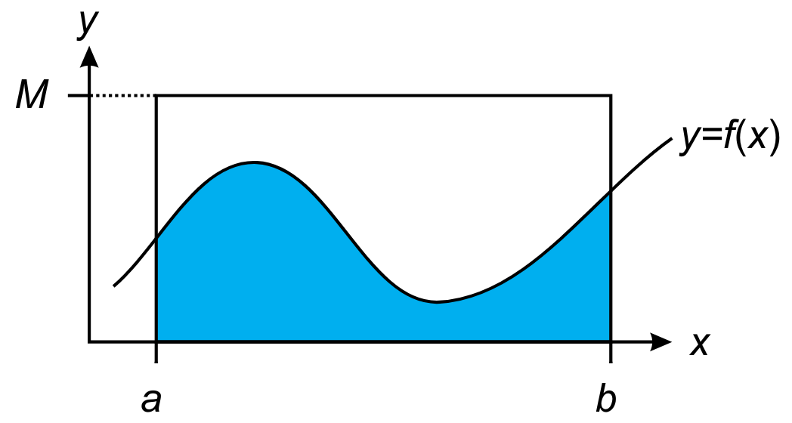

Simulation Modelling
---

* Modeller often won't be able to construct an analytical/symbolic model adequately explaining the observed behaviour (e.g. due to complexity)

> If predictions are made about the behaviour, modeller may gather data to investigate relationship between dependent variables and selected values of independent variables

* We can use computational and numerical simulation (e.g. scaling) to develop a model which could be applied to a greater data-set

## Monte Carlo Simulation

* A sequence of random numbers uniformly distributed in an interval $m$ to $n$ is used
* $\uparrow$ can be very simple to approximate complex probabilistic systems
* $\downarrow$ can be very expensive to make

### Example

We want to approximate the area under a non-negative curve

> $y=f(x), \quad$ where $0\leq f(x) \leq M$ over the interval $a\leq x \leq b$

*Monte-Carlo* solution: select a bunch of different points in the region

* Select points in the rectangular region, and count how many fall under the curve
* $\Large\frac{\text{area under curve}}{\text{area of rectangle}}$$\approx$$\Large\frac{\text{\# points counted below the curve}}{\text{total \# of random points}}$
* The accuracy wouldn't be effected by the complexity of the curve

## Queuing models
