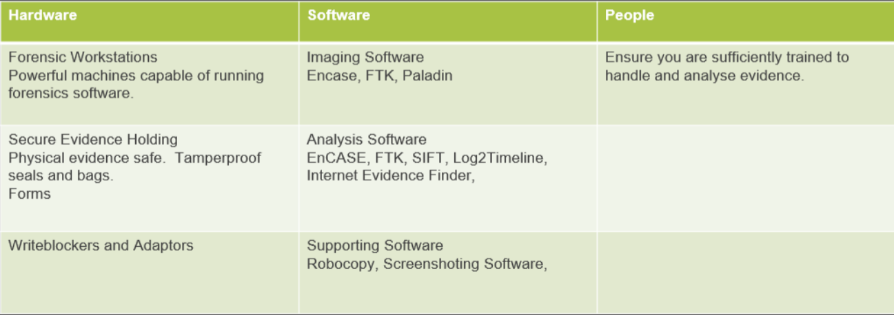
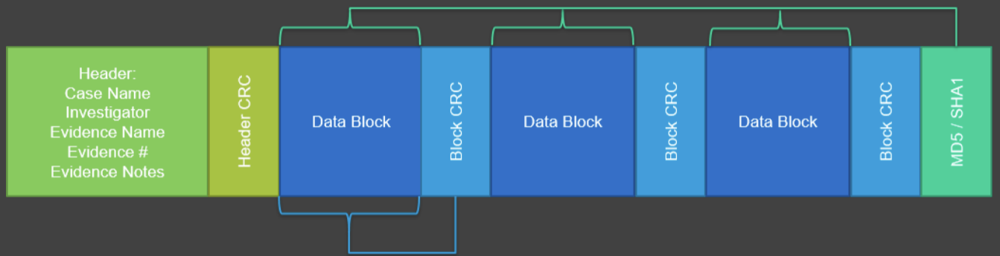
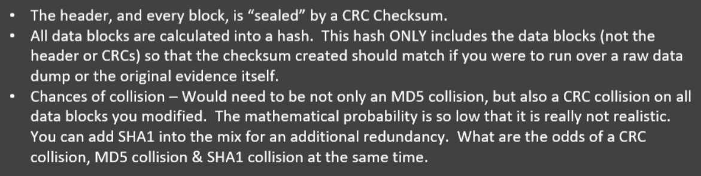
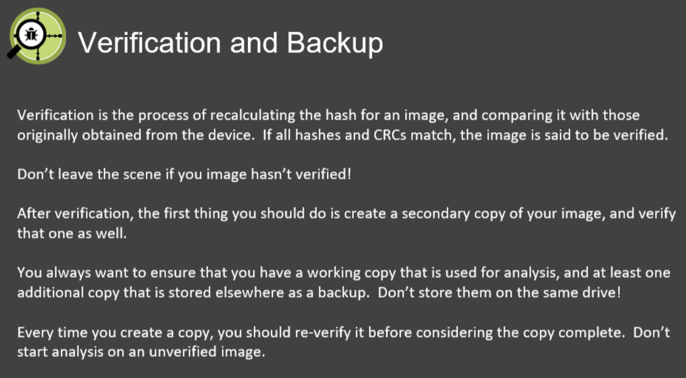
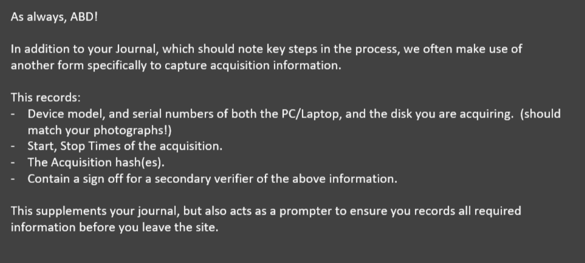

# Physical evidence handling

## Forensic methodology 

&nbsp;

## Preparation

&nbsp; 

## Seizure

- **covert**: they don't know
- **overt**: they know 
- must be legal: written permission, warrant, legal undertaking of the device 
- **secure the scene**: don't let anyone contaminate from your arrival to the time you leave 
- document arrival, steps, and departure. Maintain chain of custody from receipt to return 

> Overt could be useful as they may reveal files/their intent to conceal 

&nbsp; 

### First steps 

1. Secure the scene 
2. Document the scene (e.g. take images) 
3. Check if the computer is running, and pull the power 
     * Can pull the plug on user workstations generally, servers should be shutdown correctly
     * If the hard drives are encrypted, you may need to take a live image before pulling the plug. (preferred due to the prevalence of FDE/increased  awareness of information gleaned from memory forensics).
     * This increases the onus for forensicator to take notes of the steps they took, and the  reason they did/what effect they may have had on the evidence. 

4. Units without removable battery may need to be force shutdown with the  button. This has different effects than pulling the plug and should be  documented. 
5. Devices with mobile/WiFi connections, use a Faraday cage otherwise they could be remote wiped or interacted with (FindMyPhone, Android Device Manager). Put them into airplane mode. 

&nbsp; 

## Forensic process
**ABD** - Always be documenting 
* Work journals 
* chain of custody forms, imaging forms, physical evidence check-in/out, forensic reports 

&nbsp;

**Chain of custody**: you need to track evidence from the time you receive, to the when you return it 

* Seizure notes/ work journal 
* Chain of custody form 
* Evidence movement 
* Tamper proof evidence bags 
* Evidence safe/secure storage 

&nbsp;

**Forensic acquisition**: the process of creating exact forensic copies of digital evidence.

> e.g. A bit-for-bit copies of a digital device. 

| disk        | remove drive, attach it to forensics workstation/specialised duplicator |
| ----------- | ------------------------------------------------------------ |
| live        | run forensic software directly on devices' OS, store on external drive |
| boot CD/USB | boot device from CD/USB with OS and forensic tools, store on external drive |
| network     | connect directly to device over network, acquiring using agent pre-installed/deployed on demand |

&nbsp;

**The scientific method**: the act of investigating the evidence shouldn't change/contaminate it

**Write blocking**: provides a physical barrier to any write requests to the disk. 

* Strengthens the defensibility of our acquisition 

* Software WRB is an alternative when physical isn't available (e.g. Encase "FastBlock SE") 

&nbsp;

**Forensic image formats** 

> DD - Raw binary dump 

| pros | A bit for bit copy of the data, often split into segments for ease of handling Easily mounted as drive without additional software. Many commands work with it. Many forensic tools support dd images. |
| ---- | ------------------------------------------------------------ |
| cons | Hash calculations use md5/sha1, but needs to be manually stored/tracked/verified. Without strong process/documentation to defend it, integrity could be challenged |

> e.g. dd if=/dev/hda of=bigfile.img bs=65536 conv=noerror,sync 

&nbsp;

## Expert Witness Format (Encase/EO1) 

| pros | hash calculations/case metadata baked into format. redundant integrity checks, block and device level hashing. can be split into segments for ease of handling, has native support for compression |
| ---- | ------------------------------------------------------------ |
| cons | harder to make native commands work with EO1 files. need specialised software/libraries to create an EO1. |

&nbsp;

 

&nbsp;

## Verification and backup 

&nbsp;

## Acquisition of documentation 

