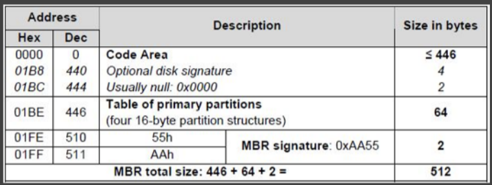
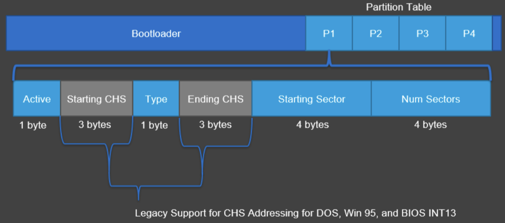
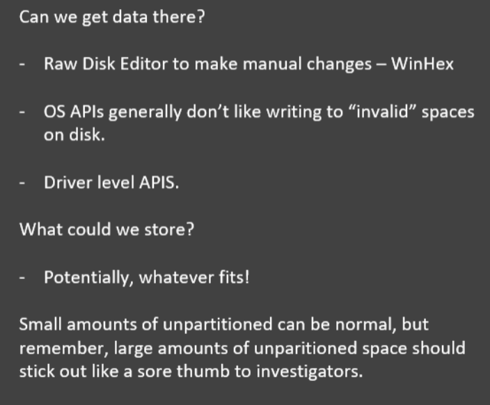
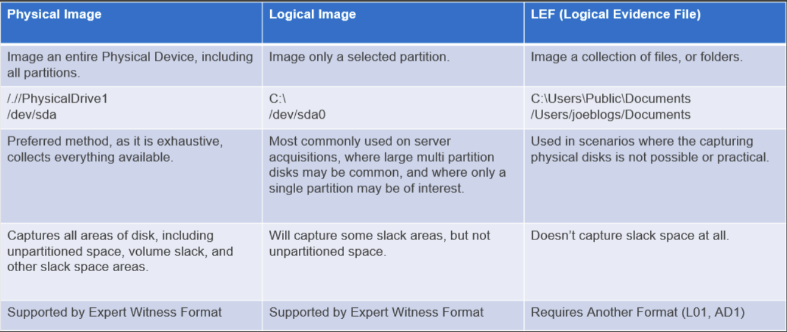
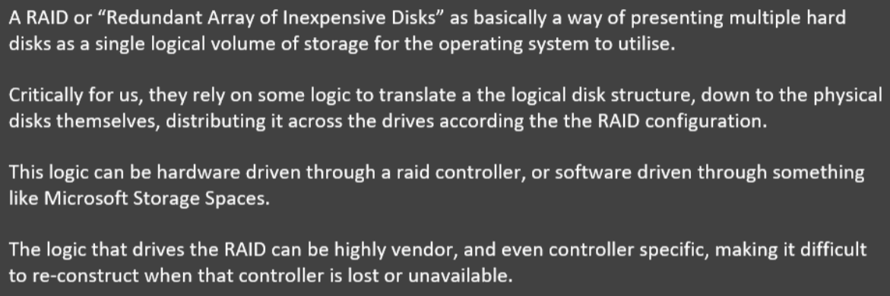
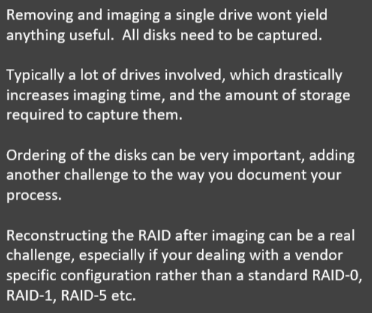
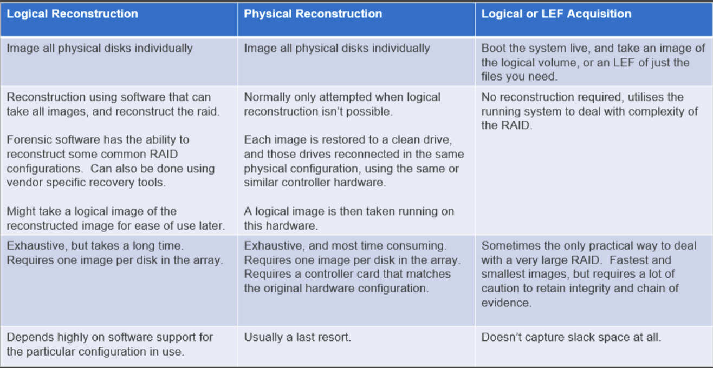
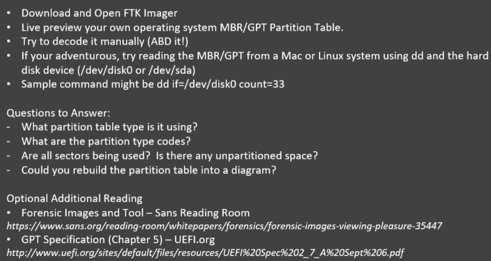

# Physical layer, data carving, acquisition and cloud

## drive physical structure

### traditional drives (hdd) 
- arranged into a number of circular platters, containing number of concentric tracks 
- each track contains blocks **(sectors)**, these are the base unit addressable on the disk 
- we address physical sectors with a **sequential LBA scheme** (not by platter/track/sector) 
- beneficial for files to be contiguous on disk (speeds up seek time) 
- [CHS addressing](https://en.wikipedia.org/wiki/Cylinder-head-sector#:~:text=CHS addressing is the process,sector is the smallest unit). 

&nbsp;

### solid state drives (sdd) 
- use NAND Flash Memory chips rather than platters 
- LBA used at logical level, translation to physical layer handled by drivers/firmware 
- **no distinct advantage to having files stored contiguously** 
- sectors can be written in almost a random pattern, making file carving difficult 

&nbsp;

### host protected areas and drive configuration overlay:
* areas not addressable by BIOS, therefore they aren't normally accessible
* detecting
  * EnCase Forensic Imager (using LinEn/Tableau write blocker), and hdparm.
  * Issue ATA commands directly to drive controller, rather than through BIOS

```bash
hdparm -N /dev/sda 
hdparm --dco-identify /dev/sda
```

&nbsp;

### verifying sector count
* after acquisition, check image's sector count matches physical devices 
* mismatch could indicate HPA, DCO or a mistake in the imaging process 
* check the imager, manufacturer manuals, and labels 

&nbsp;

## drive logical structure 

| mbd                 | master boot record contains volume locations and sizes       |
| ------------------- | ------------------------------------------------------------ |
| volumes             | logical container for filesystems. filesystem ≠ volume       |
| filesystems         | structures that sit within a volume, and allow files to be organised/saved |
| clusters            | sectors aren't an efficient way for file systems to address, instead organised  into clusers (groups of sectors). Files assigned entire clusters as they grow |
| unpartitioned space | if you don't assign all sectors to a partition, they will sit within unpartitioned space on the drive |

&nbsp;

### master boot record
* the first sector on a drive (LBAO)
* First section contains bootstrap code.
  * If drive bootable: contains code to transfer control to this.

* Next 64 bytes contain partition table (max 4 entries) 



&nbsp;

## partition tables

### MBR PT
> each entry describes start sector, size and partition type 



&nbsp;

### GUID PT
* more space assigned (allows up to 128 partition and max capacity of 18 exabytes) 
* contains protective MBR at LBAO to ensure older devices don't wipe drive on connect 
* contains a single partition entry with type code 0xEEh 

&nbsp;

### modifying PT

* zeroing out an entry in the partition table marks it as free, the actual  partition won't be modified.
* however to the OS the partition doesn't exist

&nbsp;

### unpartitioned space



&nbsp;

### hidden partitions
* using a tool that modifies the partition table, we could hide/show partitions 
* insecure, unpartitioned space is still completely visible, partition table may  have traces, and filesystems have signature (volume boot) at start of  volume. 
* encrypt data $\rarr$ now looks random, signature isn't visible. Still large gap in partition table 

&nbsp;

### volume slack

> unused space between end of file system and end of partition 

&nbsp;

**acquisition**: left to right is best to worst (generally) 



&nbsp;

**Imaging a RAID (Redundant Array of Inexpensive Disks)**: 



&nbsp;

### Acquisition



&nbsp;

### Cloud based disks
> unlikely to have access to physical infrastructure 

| option A         | acquire copy of vm/vhd from admin console. Can be directly imported into  forensic tools if using common format. Requires admin privileges however |
| ---------------- | ------------------------------------------------------------ |
| option B         | acquire live on cloud system. Not good, you need to download everything across  the network, which can have bandwidth issues/you may be noticed if  covert. |
| Data sovereignty | ensure you have clear advice from lawyers before dealing with data outside of your jurisdiction |

&nbsp;

### TODO

