## Forensic method and ethics

**forensically sound**: digital evidence collected via standard, documented, proven forensic process

> admissible evidence must be **defensible** and **repeatable** 

| defensible | process accepted as industry standard/proven to be sound/precedent |
| ---------- | ------------------------------------------------------------ |
| repeatable | process well-documented, 3rd-party could replicate results given same data |

 

### principles of handling digital evidence 

1. all general forensic/procedural principle must be applied when handling digital evidence 
2. actions should be taken to not modify evidence 
3. anyone accessing evidence should be trained to do so 
4. document all activity related to seizure, access, storage and transfer of evidence 
5. individual responsible for all that occurs to digital evidence in their possession 
6. any agency responsible for digital evidence is responsible for complying with principles 

 

**Forensic process** 

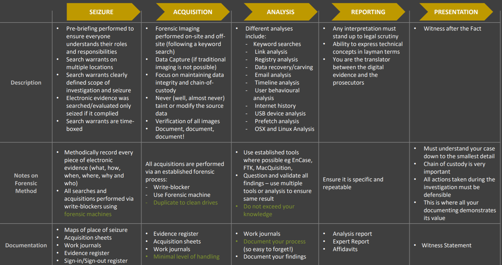

* **ethics**: moral principles that govern a person's behaviour or the conducting of an activity 

* **morals**: standards of behaviour, principles of right/wrong. Emphasis on widely shared norms. 

 

### questions to help guide an ethical decision 

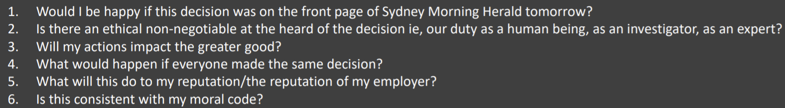

* ethical but amoral (e.g. refusing to defend a terrorist, but if they don't have any representation the case against them would be dropped)
* ethics are generally defined by a relevant industry body, while morals are personal 
* International Society of Forensic Computer
* Examiners Code of Ethics 

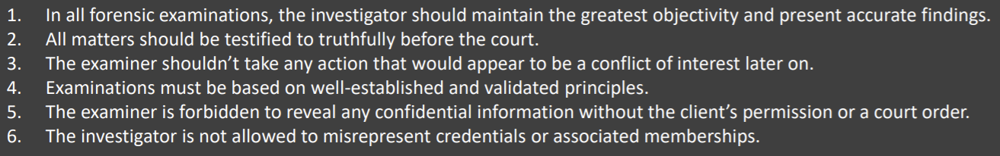


### elements of ethics 

| honesty and competency         | ensure you are qualified to perform a task (reflect on capabilities) represent yourself accurately, and continually improve yourself present evidence honestly, accurately, and completely |
| ------------------------------ | ------------------------------------------------------------ |
| understanding legal boundaries | operate within the law (obtain and handle evidence legally/properly) understand standards of proof in civil vs criminal cases |
| objectivity                    | don't be influened by information outside scope of investigation, or incompletely evidence limit scope of analysis/opinion based on information provided |
| independence and integrity     | ensure you are independent/avoid conflict of interest e.g. personal/ secular (business) relationships, financial interests be transparent, disclose potential conflicts of interest |
| confidentiality                | keep all evidence confidential, including irrelevant extra info. organisation data may be commercially sensitive/legally privileged |
| being a good human             | respect colleagues, share information (publication, mentoring, presentations) investigating people, outcomes can have large long lasting impact |


## Physical layer, data carving, acquisition and cloud

### drive physical structure 

#### traditional drives (hdd) 

- arranged into a number of circular platters, containing number of concentric tracks 
- each track contains blocks **(sectors)**, these are the base unit addressable on the disk 
- we address physical sectors with a **sequential LBA scheme** (not by platter/track/sector) 
- beneficial for files to be contiguous on disk (speeds up seek time) 
- [CHS addressing](https://en.wikipedia.org/wiki/Cylinder-head-sector#:~:text=CHS addressing is the process,sector is the smallest unit). 

 

#### solid state drives (sdd) 

- use NAND Flash Memory chips rather than platters 
- LBA used at logical level, translation to physical layer handled by drivers/firmware 
- **no distinct advantage to having files stored contiguously** 
- sectors can be written in almost a random pattern, making file carving difficult 

 

### host protected areas and drive configuration overlay:

* areas not addressable by BIOS, therefore they aren't normally accessible
* detecting
  * EnCase Forensic Imager (using LinEn/Tableau write blocker), and hdparm.
  * Issue ATA commands directly to drive controller, rather than through BIOS

```bash
hdparm -N /dev/sda 
hdparm --dco-identify /dev/sda
```

 

**verifying sector count**: after acquisition, check image's sector count matches physical devices 

- mismatch could indicate HPA, DCO or a mistake in the imaging process 
- check the imager, manufacturer manuals, and labels 

 

**drive logical structure** 

| mbd                 | master boot record contains volume locations and sizes       |
| ------------------- | ------------------------------------------------------------ |
| volumes             | logical container for filesystems. filesystem ≠ volume       |
| filesystems         | structures that sit within a volume, and allow files to be organised/saved |
| clusters            | sectors aren't an efficient way for file systems to address, instead organised  into clusers (groups of sectors). Files assigned entire clusters as they grow |
| unpartitioned space | if you don't assign all sectors to a partition, they will sit within unpartitioned space on the drive |

 

**master boot record:** the first sector on a drive (LBAO)

* First section contains bootstrap code. If drive is bootable, contains code to transfer control to this.
* Next 64 bytes contain partition table (max 4 entries) 

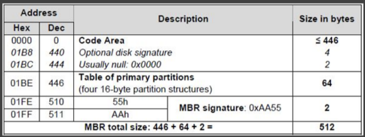


### partition tables

**MBR PT**: each entry describes start sector, size and partition type 

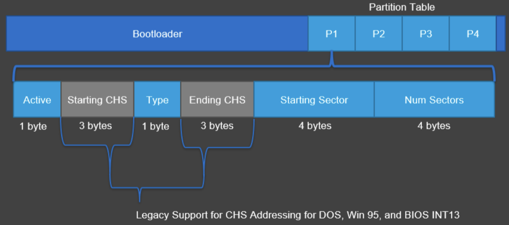

 

**GUID PT**: more space assigned (allows up to 128 partition and max capacity of 18 exabytes) 

- contains protective MBR at LBAO to ensure older devices don't wipe drive on connect 
- contains a single partition entry with type code 0xEEh 

 

**modifying PT**

* zeroing out an entry in the partition table marks it as free, the actual  partition won't be modified.
* however to the OS the partition doesn't exist

 

**unpartitioned space**: 

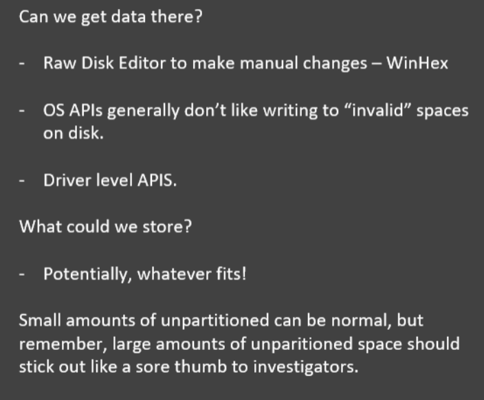

 

**hidden partitions**: using a tool that modifies the partition table, we could hide/show partitions 

- insecure, unpartitioned space is still completely visible, partition table may  have traces, and filesystems have signature (volume boot) at start of  volume. 
- encrypt data → now looks random, signature isn't visible. Still large gap in partition table 

 

**volume slack**: unused space between end of file system and end of partition 

 

**acquisition**: left to right is best to worst (generally) 

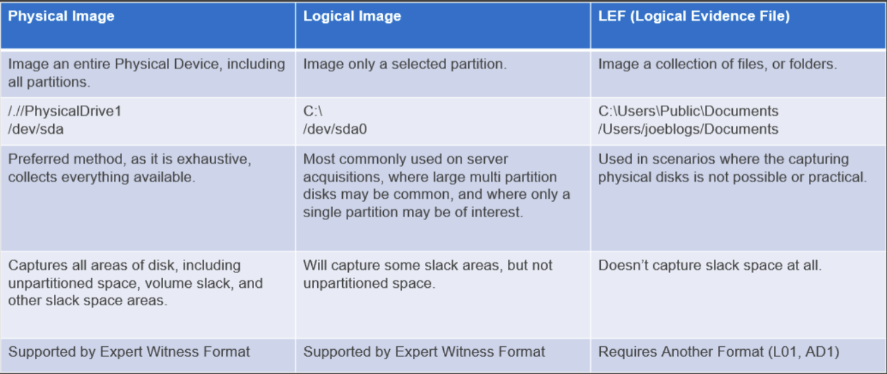

 

**Imaging a RAID (Redundant Array of Inexpensive Disks)**: 

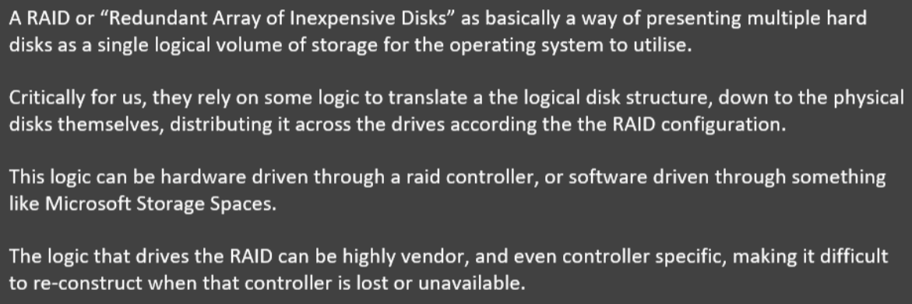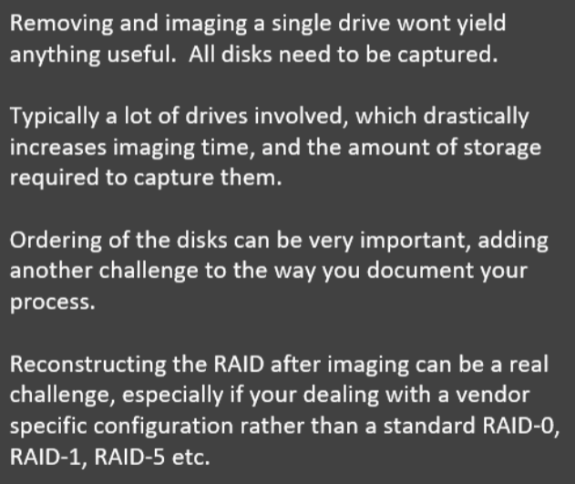


**Acquisition** 

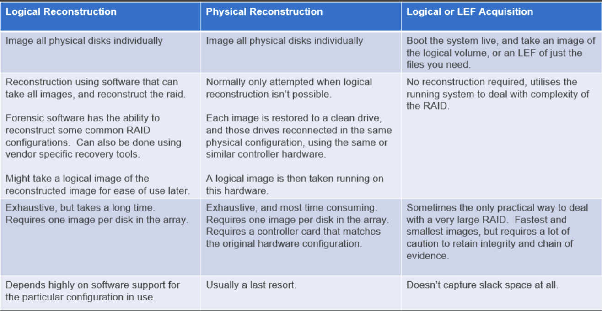

 

**Cloud based disks**: unlikely to have access to physical infrastructure 

| option A | acquire copy of vm/vhd from admin console. Can be directly imported into  forensic tools if using common format. Requires admin privileges however |
| -------- | ------------------------------------------------------------ |
| option B | acquire live on cloud system. Not good, you need to download everything across  the network, which can have bandwidth issues/you may be noticed if  covert. |
| Data sovereignty | ensure you have clear advice from lawyers before dealing with data outside of your jurisdiction |

 

### TODO

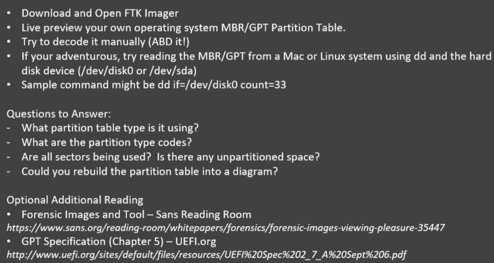