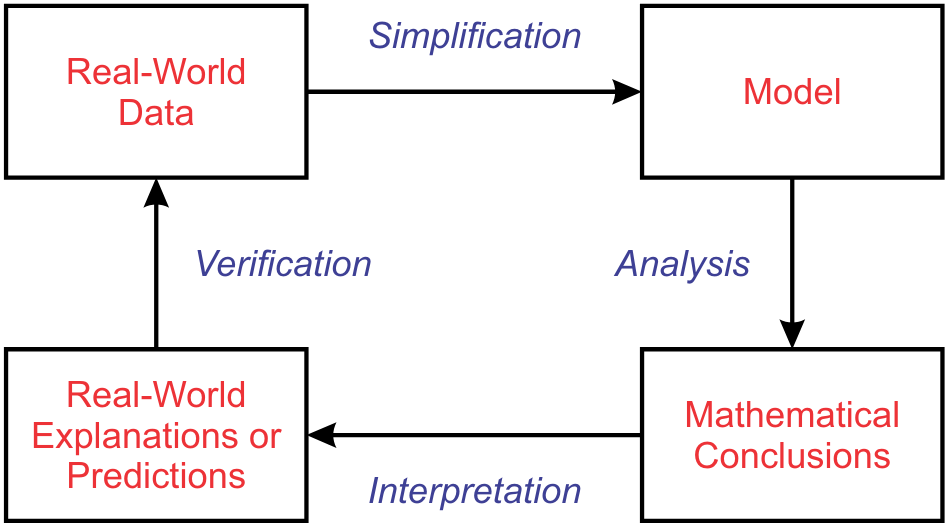
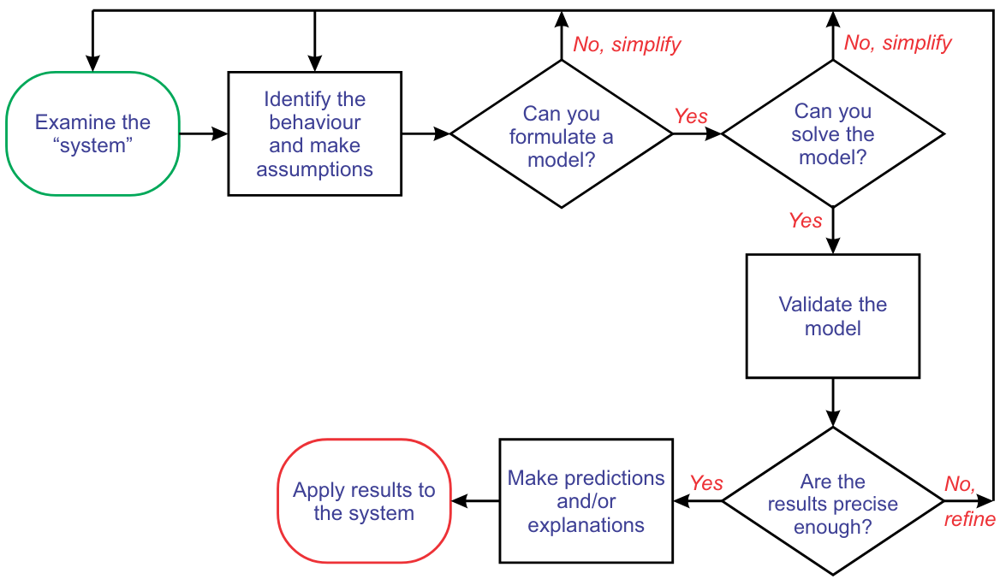
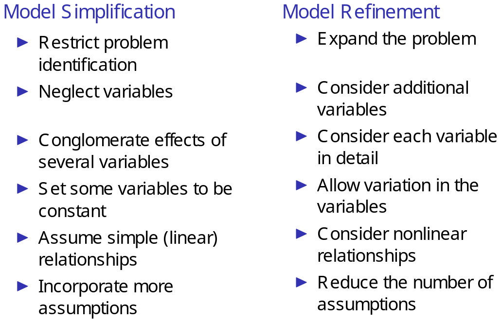

# Introduction

System: An assemblage of objects joined in some regular interaction or interdependence.

## Closed Loop modelling process

Model construction is an iterative process.
1. examine system: identify behaviours we wish to predict/explain.
2. Identify variables, simplifying assumptions
    * Simplifying assumptions for variables: treating some as constants, neglecting/aggregating some
    * Assuming simple relationships (e.g. linearity) in any submodel or restricting the problem under investigation.
3. Generate a model.

### It's an iterative process

#### Simplifying/refining assumptions

## Model conclusions
* **Robust**: conclusions don't depend on precise satisfaction of the assumptions.
* **Fragile**: conclusions do depend on precise satisfaction of some conditions.
* **sensitivity**: the degree of change in model’s conclusions as some condition they depend
is varied; (greater change => more sensitive to that conclusion)

## The process
1. Clarify the question, set up the problem in mathematical
terms
2. Select the modelling strategy, solution procedure
3. Formulate the model in standard mathematical form
4. Solve the mathematical problem
5. Answer the original problem in non-technical terms
