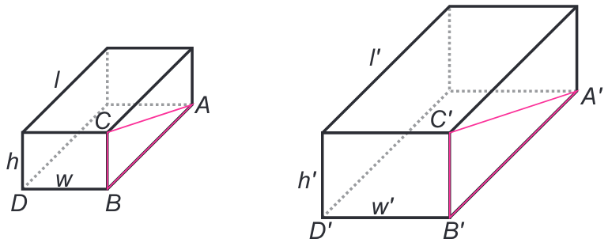

Proportionality, Similarity and Ubiquitous Relationships
--

## Proportionality
* A simplifying relationship (approximate)
* Geometric interpretation: linear relationship with zero intercept

    $y \propto x \iff y = kx, k \text{ constant}$

    $y \propto x, x \propto z \implies y \propto z$

Famous proportionalities
* *Hooke’s Law*
* *Newton’s Law*
* *Ohm’s Law*
* *Boyle’s Law*
* *Einstein’s Theory of Relativity*
* *Kepler’s Third Law*

## Geometric similarity
Two objects have a one-to-one correspondence between points (the ratio of distances between corresponding points is constant $\forall$ possible pairs of points)

For geometric similarity:

* $\Large\frac{l}{l'}$$=$$\Large\frac{w}{w'}$$=$$\Large\frac{h}{h'}$$=$ $k, k>0$
* $\Large\frac{V}{V'}$$=k^3$, and $\Large\frac{S}{S'}$$=k^2$

So:
* $\Large\frac{S}{S'}$$=k^2$$=\Large\frac{l^2}{l'^2}$
* $\Large\frac{S}{l^2}$$=\Large\frac{S'}{l'^2}$$=C\in\mathbb{R}$
* $S\propto l^2 \text{ and } V \propto l^3$

Thus a function based on length, surface area and volume:
* $y=f(l,S,V)=f(l,l^2,l^3)$

## Exponential decay & power laws
Exponential decay $y=Ce^{-bx}$ can be represented as
* $Y = ln(y) = ln(Ce^{-bx})=-bx+ln(C)$
* Power laws could be presented with $\lambda = -bx$

## Self-similarity
The comparison of functions on different scales
* $y(x)=\alpha y (\beta x)$
