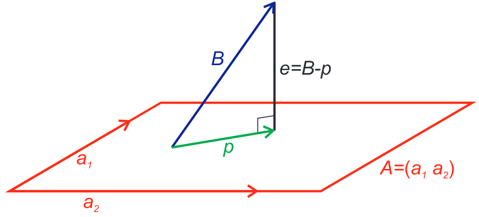

Fitting Real World Data
---

## Tasks for model fitting

1. fitting a selected model type/s to data
2. choosing the most appropriate model from competing fitted types
3. making predictions from the collected data

> **1 & 2** are concerned with the ability of the model to explain observed behaviour
> **3** is concerned with prediction of the behaviour within some range of interest

### Sources of error

1. *Formulation*: oversimplication/neglecting certain variables
2. *Truncation*: numerical method errors (e.g. finite version of infinite sums)
3. *Round-off*: insufficient precision in calculations
4. *Measurement*: imprecision in data collection (human error/equipment limitations)

### Considerations

1. Number of data points
2. Range of data the model is to be used
3. Spacing of the data points (unequal spacing biases weighting of a fit)
4. Accuracy of data (how was it collected, accuracy of equipment, any outliers?)

## Linear correlation

### Equations

> *Mean*: $\bar x =$ $\Large\frac{1}{N}\sum_{i=1}^{N}$$x_i$
> 
> *Correlation coefficient*: $r=$ $\Large\frac{\sum_{i=1}^{N}(x_i-\bar x)(y_i-\bar y)}{\sum_{i=1}^{N}(x_i-\bar x)^2\sum_{i=1}^{N}(y_i-\bar y)^2}$

### Errors

> $Y_i = mx_i + b$
>
> *Error function*: $E=\Large\sum_{i=1}^{N}$$(y_i - Y_i)^2$
> 
> *Standard errors*: $s=$$\Large\sqrt {\sum_{i=1}^{N}\frac{(y_i-Y_i)^2}{N-2}}$

### Line of best fit
* We can represent $Y_i=mx_i+b$ as $AX=B$,  where $X=(m, b)^T$ and $B=Y_i^T$
* We then solve for $X$ by writing the problem as if $B$ lies in the span of the columns of $A$. We project $B$ onto some space spanned by $A$, giving the error $e=B-AX$.
* We can minimise this with
	* $A^TAX=A^TB$
	* $X=(A^TA)^{-1}A^TB$
	* $E=e^Te=(B-AX)^T(B-AX)$ 

### Quadratic of best fit
> Very similar to linear, but it's a $3\times n$ matrix, not $2\times n$

## Transforming the relationship

### Exponential

> $y=ae^{kx}$ could be represented as:
>
> $Y=kx+b, \qquad Y=ln(y), \quad b=ln(a)$

### Power relationship

> $p=ct^d$ could be represented as
>
> $P=dT+b, \qquad P=ln(p), \quad T=ln(t), \quad b=ln(c)$ 

## Comparison of fits

> Error sum of squares: $SSE=E=\Large\sum_{i=1}^{N}$$(y_i - mx_i-b)^2$
>
> Total corrected SS: $SST=\Large\sum_{i=1}^{N}$$(y_i - \bar y)^2$
>
> Regression SS: $SSR=SST-SSE$
>
> Coefficient of Determination: $R^2=1-$$\Large\frac{SSE}{SST}$

### Residuals
* This is the errors between individual observed and predicted values
* Residuals should be randomly distributed/contained within reasonably small band
> $r_i=y_i-Y_i=y_i-(mx_i+b)$

## Choosing a best model

### Least squares criteria
1. Compute the error between model and data. (bound maximum error as well)
2. Minimise the residuals

### What to consider
1. Purpose of the model
2. Precision required by the scenario
3. Accuracy of the data
4. Range of values for independent variable over which model is used
