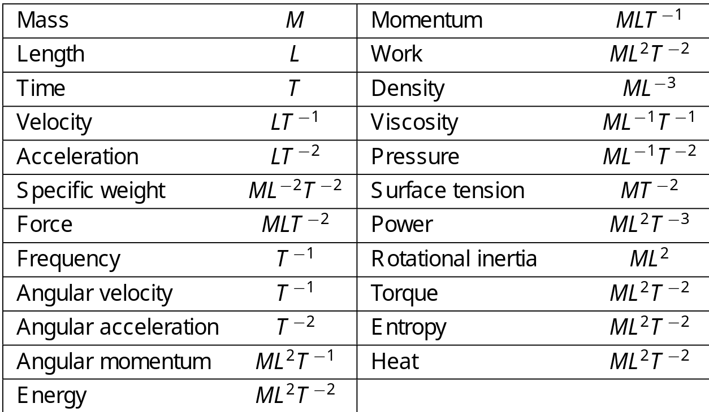

Dimensional analysis
---

### Experimental investigations

* We'll need a number of data points to measure how changing the input impacts the output.
  * e.g. we may want $k^n$ where $k$ is some acceptable number of points, and $n$ is the number of variables.
  * This can be an issue when $n \rightarrow \infty$ (even for small $k$).
* If some variables are combinations of others (e.g. $x=$$\large\frac{uv}{w}$), we can reduce it to another function, and such reduce $n$.
* E.g. we could reduce velocity, acceleration, force, energy, work, etc, into mass $M$, length $L$, and time $T$ (e.g. $F=ma$)

## Dimensions as products

We can turn most things into some combination of $M, L, T$.

* The dimension of a product is an expression of the form $M^n L^p T^q$
* it is said to be *dimensionless* $\iff$ $n=p=q=0$

### Examples

> $\text{velocity} = \Large\frac{\text{displacement}}{\text{time}}$$=LT^-1$
>
> $\text{area} = \text{length}^2 = L^2$
>
> $\text{momentum} = mv = m \Large\frac{ds}{dt}$ $=MLT^{-1}$
>
> $\text{kinetic energy} = \Large\frac{mv^2}{2}$$ = ML^2T^{-2}$

### Dimensions

* *Dimensionally incompatible*: We cannot add products of unlike dimensions
* *Dimensional homogeneity*:  An equation which is true regardless of the system of units
  * E.g. we want $1=f(...)$ where $f(...)$ is dimensionless

**General rules**

1. Choose the dependent variable so it only appears once
2. Select any variable that appears in the most equations
3. Choose a variable that always has a zero coefficient

### Buckingham's Theorem

An equation is dimensionally homogeneous $\iff$ it can be put in the form

* $f(\Pi_1, \Pi_2, ..., \Pi_n)=0$
* $f$ is some function of $n$ arguments, $\{\Pi_1, \Pi_2, ..., \Pi_n\}$ is a complete set of dimensionless products

## Summary

1. Decide which variables enter the problem
2. Determine the set of dimensionless products among the variables (dependent variables should only appear in one product)
3. Apply Buckingham's Theorem to produce all possible dimensionally homogeous equations
4. Solve equations for the dependent variable
5. Test to ensure assumptions are reasonable (adjust variables accordingly)
6. Design experiments to determine and arbitrary relationships

### Example dimensions

