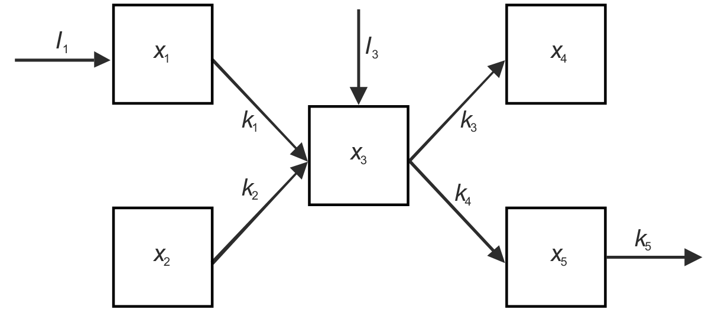
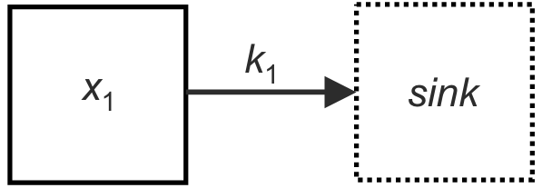
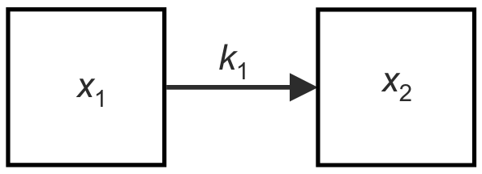
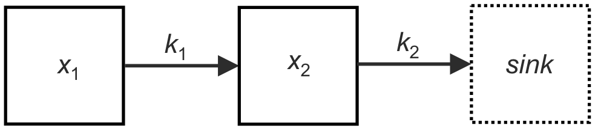
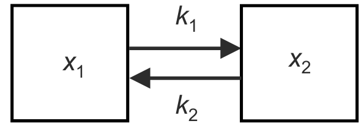
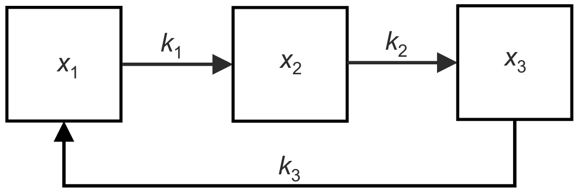
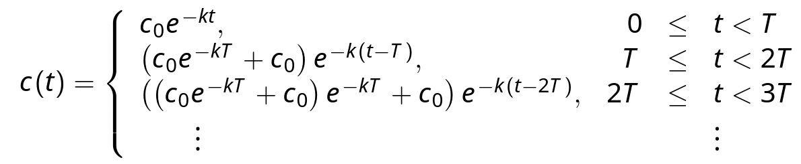

The balance law and compartment models
---

### Compartment models

Used to account for different behaviours in different parts of a system

* It's like a function, arrows into a box are inputs, out are resulting outputs
  * Arrows pointing out of a box, but not into one are substances exiting the system
  * Arrows pointing into a box, but not out of ones are external sources

> $x_i(t)$ denotes the amount of substances in box $i$ at time $t$
>
> the $k_i$ attached to arrows joining boxes $i$ and $j$ indicate the subtance leaves box $i$ and enters $j$

### The balance law

> $\text{Net range of change} = \text{Rate in} - \text{Rate out}$

### Linear cascade (the easiest compartment models)

A compartment model is a linear cascade if:

* No directed chain of arrows/boxes begins and ends at the same box
* the substance exists a box at a rate proportional to the amount in the box, if it enters another box, it does so at that same rate.

>  Solve this by solving the first, then use that result to solve the second, etc

## Compartments

### A single compartment

We can use the first order equation $\Large \frac{dx_1}{dt}$$=k_1x_1$ to model the following compartment

> Here, we have a quantity $x_1$, leaving at a rate $k_1$ 
>
> The solution is $x_1(t)=A_1e^{-k_1t}, \quad x_1(0)=A_1$

### Two compartments

We make use the pair of first order $\Large\frac{dx_1}{dt}$$=-k_1x_1 \quad \Large\frac{dx_2}{dt} $$= k_1x_1$ equations to model this

> Instead of leaving the system, the output of the first is drained into the second
>
> Notice that it has the closed property:
> * $\Large\frac{dx_1}{dt} $$+\Large\frac{dx_2}{dt}$$=0$  
> * $\Large\frac{d(x_1 + x_2)}{dt}$$=0$
> * $x_1 + x_2 = C$
>
> The solution is
> * $x_1=A_1e^{-k_1t}$
> * $x_2=C-x_1=(A_1+A_2)-A_1e^{-k_1t}$

### Two compartments with a sink

This is the same as above, with an additional term $\Large\frac{dx_1}{dt}$$=-k_1x_1 \quad \Large\frac{dx_2}{dt} $$= k_1x_1 - k_2x_2$

> 

### Two compartment w/ cycle

Similarly to above, now we need an additional term in both $\Large\frac{dx_1}{dt}$$=-k_1x_1 +k_2x_2 \quad \Large\frac{dx_2}{dt} $$= k_1x_1 - k_2x_2$

### Multiple compartment cycles

> $\Large\frac{dx_1}{dt}$$=-k_1x_1+k_3x_3$
> 
> $\Large\frac{dx_2}{dt}$$=k_1x_1=k_2x_2$
> 
> $\Large\frac{dx_3}{dt}$$=k_2x_2-k_3x_3$

> can be solved with linear algebra (treat it as a matrix)

Any cyclical system has the closed, conservative property:

> $\Large\frac{dx_1}{dt}$$ = \Large\frac{dx_2}{dt}$$ = \Large\frac{dx_3}{dt}$$=0$

## Pharmacokinetics

Modelling the flow of medication as it dissolves and is released into the gastrointestinal tract.

> We can divide the body up into compartments, representing parts of the body

### One compartment (single dose)

Suppose you inject $A$ units of drug, and $c$ is the concentration in the compartment (so it reduces over time)

>  $\Large\frac{dc}{dt}$$=-kc$
>
>  Initial concentration: $c_0=\Large\frac{A}{V_B}$,    $V_B$ is the volume of blood
>
>  Integrating we have: $c(t)=c_0e^{-kt}$

### Repeated doses

What if we wanted to maintain concentration above a certain level (inject $c_0$ every $T$ units of time)

​	Maximum concentration is just after a dose, minimum is just before

> $c_{\max} \approx \Large\frac{c_0}{1-e^{-kT}}$
>
> 
