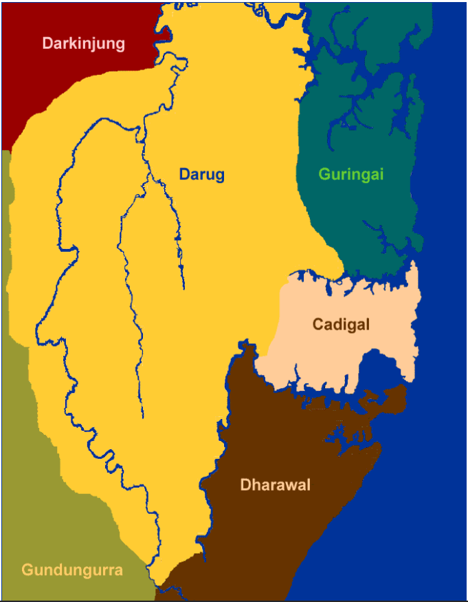

# humans and the environment

## aboriginal people of sydney

[eight days in kamay](https://www.sl.nsw.gov.au/stories/eight-days-in-kamay/introduction/2)

#### captain cook

* cpt cook was sent to work out the transit of venus, to work out longitude
* messed up the measurements completely
* given secret instructions to go to australia, days ahead of french who were held back by a storm
* Dutch reports, and idea there must be land in the south to balance land in the north

#### first fleet (1788)

* aboriginal people came down dressed for war to propel the invaders
* they shot a "small shot" between two men, which was actually shot at Gweagal warrior Cooman, piercing his shield.
* first fleet raises a flag, and "becomes australia"
* colonies pop up in sydney, the melbourne, which form into states, and then federated together

### Idk
#### language groups

* great diversity, 250-300 distinct languages (600 dialects)
* people were multilingual, but language was lost due to colonial impact

#### social organisation

* not as heirarchical
* clans (extended family), 
* extended clans (different language groups) would come together for feasts or ceremonies
* salt-water people would be tied to salt-water resources, seafood. Not all groups moved around as much
* obligations to your land based on your clan
* considered an 'eora nation' which actually just meant they're from "here" (Australia)

#### community

* oral culture (storytelling, performance and visual art), things were passed down by voice through thousands of years
* 2000+ rock engravings are in the Sydney Basin
* culture taboo against eating fish
* aboriginal people arrived in australia 40 - 60,000 years ago (or 65)

#### Sydney regions: local clans

* Cadigal people are the inner-city
* Boundaries between the lands are fuzzy

* Cadigal described Darug as "tree-climbers"
  * Used axes to make notches in trees, and capture/eat possums
* Coastal ones (Guringai, Cadigal, and Dharawal) used salt-water resources
* Possible that Guringai is a misinterpretation
* Gundungurra people were south-west and blue mountains
* Cranbrook terrace has artefacts 40 - 50,000 years old (people have been in Sydney that long)

#### Early agriculture

* Fields of yams were proof of early agriculture

#### Middens

* piles of shells/bones, showed what resources the aboriginals were using
  * used by other clans to work out what resources were best to use
  * used to compare what inland vs coastal clans used
* kind of like a bin

doodoo man (horned beast)
